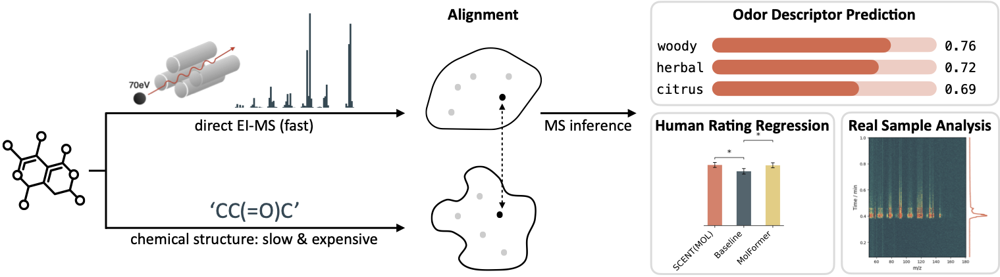

# SCENT: Aligning Mass Spectra with Molecular Structure for Olfactory Perception



A two-stage pipeline for **direct EI mass spectrometry representation learning**:

1. **Contrastive alignment** — train an EI-MS encoder so its outputs live in the same vector space as a pretrained chemical-structure embedding (Molformer / OpenPOM). The chemical encoder stays frozen; only the MS side learns.
2. **Downstream odor classification** — freeze (or fine-tune) the aligned MS encoder and train a small classification head on a multi-label odor-descriptor dataset, evaluated under k-fold cross-validation with several training-data fractions.

The MS encoder is a Skip-Gram-style peak embedding (`Spec2Emb`, "EIMS2Vec") followed by an optional small Transformer over peaks (`MSTransformer`). Chemical embeddings are pre-computed and loaded from CSVs (Molformer 768-d, or OpenPOM 256-d); the chemical side is never trained, only used as a target.

> **This repository contains code only.** No mass-spectrometry data is included or distributed. The sections below describe the input schema you need to assemble locally so the code can read it; nothing here ships any spectra.

## Installation

Tested with **Python 3.10**, **CUDA 12.x**, **PyTorch ≥ 2.0**.

```bash
git clone <this-repo>.git
cd multimodal_emb_clean

# Recommended: a fresh conda env
conda create -n scent python=3.10 -y
conda activate scent

# Core deps
pip install torch torchvision torchaudio --index-url https://download.pytorch.org/whl/cu121
pip install numpy pandas scikit-learn matplotlib tqdm

# RDKit (cheminformatics)
conda install -c conda-forge rdkit -y

# Optional: only needed if you extract openpom embedding
pip install deepchem
pip install openpom
```

CPU-only installs work but training is impractically slow; an NVIDIA GPU with ≥ 16 GB RAM is recommended for the contrastive stage at batch size 512.

## Preparing your own data

The code does not bundle any spectra. To run training or inference you assemble a few CSVs locally; the schema below is exactly what the loaders parse. Filenames in the example commands later are placeholders — point the `--*_csv` / `--data_path` flags at whatever you have.

### MS spectra table

A row per spectrum. The MS itself is represented as a 1000-d non-negative intensity vector binned over m/z = 0..999. Required columns, **in this order**:

```
Unnamed: 0, index, cid, canonical_smiles, 0, 1, 2, ..., 999
```

- `cid` — PubChem CID (integer). This is the join key against the chemical-embedding table.
- `canonical_smiles` — RDKit canonical SMILES. Used by `structure_split_indices` to enforce a SMILES-grouped train/val/test split so the same structure never crosses splits.
- Columns `0..999` — non-negative intensities binned to integer m/z. Internally `to_model_data()` rescales each row so the most intense peak equals 999 and drops zero bins.

### Chemical-embedding table

A row per compound, joined to the MS table by `cid`. Two formats are recognised:

- `--chem_model_type molformer` — CSV with `CID, canonical_smiles, 0, 1, ..., 767` (768-d).
- `--chem_model_type openpom`   — CSV with `CID, canonical_smiles, 0, 1, ..., 255` (256-d).

Build these once with any pretrained chemical encoder you have access to (e.g. official Molformer or OpenPOM checkpoints) by encoding the SMILES that match your MS table's `cid` set.

In each label CSV the first 3 columns are treated as metadata; everything from column index 3 onward is read as one-hot labels. 

## Generating the chemical-embedding CSVs

SCENT does not train a chemical encoder; it consumes pre-computed embeddings as the alignment target. Generate them yourself from one of the upstream repositories below, then save into the schema described in **Chemical-embedding table** above.

### Molformer (768-d)

Upstream: [IBM/molformer](https://github.com/IBM/molformer). Use the checkpoint `N-Step-Checkpoint_3_30000.ckpt`

Pass the resulting CSV via `--chem_emb_csv your_mol_emb.csv --chem_model_type molformer` to `contra_main_final.py`.

### OpenPOM (256-d)

Upstream: [ARY2260/openpom](https://github.com/BioMachineLearning/openpom). Follow the upstream installation (`pip install openpom` plus DeepChem). Please following the `mpmm_pom_train.ipynb`

Pass the resulting CSV via `--chem_emb_csv your_pom_emb.csv --chem_model_type openpom`.

> The exact module to hook into depends on the OpenPOM commit you check out — verify against the upstream source. Dimensionality must match what the alignment projector expects (`proj = nn.Linear(500, chem_len)` where `chem_len` is inferred from the CSV's column count after the two metadata columns).

## Extracting embeddings from a trained checkpoint

This is the most common downstream use of a trained model. The pattern is the same regardless of whether you trained with the simple or Transformer encoder — only the constructor differs.

```python
import torch, numpy as np, pandas as pd
from torch.utils.data import DataLoader

from utils_ms import Spec2Emb, MSTransformer
from data    import CLIPDataset, clip_collate

DEVICE = "cuda" if torch.cuda.is_available() else "cpu"
CKPT_POM = "pom_clean_trans_clip_10base.pt"            # checkpoint from contra_main_final.py
CKPT_MOL = 'mol_clean_trans_clip_10base.pt'
USE_TRANSFORMER = True                      # must match how it was trained

# 1. Build the encoder with the same geometry used in training
base = Spec2Emb(num_emb=1000, emb_dim=500)
if USE_TRANSFORMER:
    encoder = MSTransformer(base_encoder=base, d_model=500, nhead=4, num_layers=2)
else:
    encoder = base

# 2. Load weights. Checkpoints saved by contra_main_final.py are dicts.
state = torch.load(CKPT, map_location=DEVICE)
encoder.load_state_dict(state["ms_encoder"])
encoder = encoder.to(DEVICE).eval()

# 3. (Optional) load the alignment projector to chem space
proj = torch.nn.Linear(500, 768).to(DEVICE)   # use 256 for OpenPOM
proj.load_state_dict(state["proj"])
proj.eval()

# 4. Run on your own merged MS+chem table (same schema used during training).
df = pd.read_csv("your_merged_table.csv")
ds = CLIPDataset(df, augmentor=None, training=False)
loader = DataLoader(ds, batch_size=64, shuffle=False,
                    collate_fn=clip_collate)

all_emb = []
with torch.no_grad():
    for _, ms_batch, _, _ in loader:
        mzs, intens, masks = [x.to(DEVICE) for x in ms_batch]
        emb = encoder((mzs, intens, masks), mode="emb")   # Spec2Emb: (B, L, 500); MSTransformer: (B, 500)
        if not USE_TRANSFORMER:
            emb = emb.sum(dim=1)                          # sum-pool peak-level Spec2Emb output
        chem_emb = proj(emb)                              # (B, 768) or (B, 256) — optional
        all_emb.append(chem_emb.cpu().numpy())

all_emb = np.concatenate(all_emb, axis=0)
print(all_emb.shape)
```

## Citation


